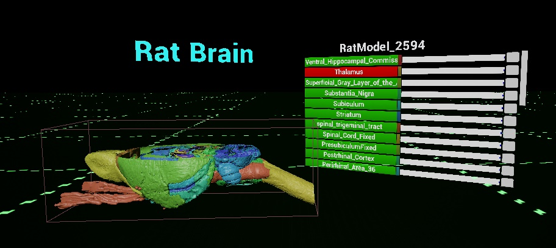
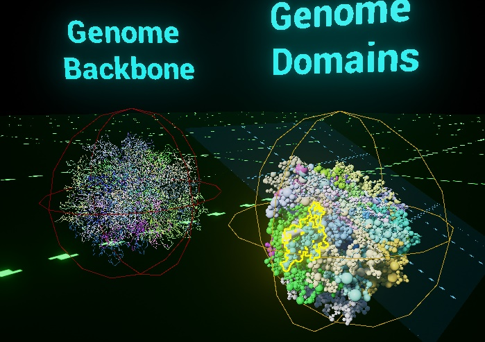
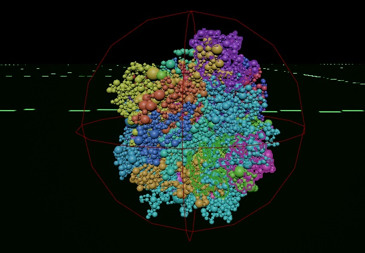
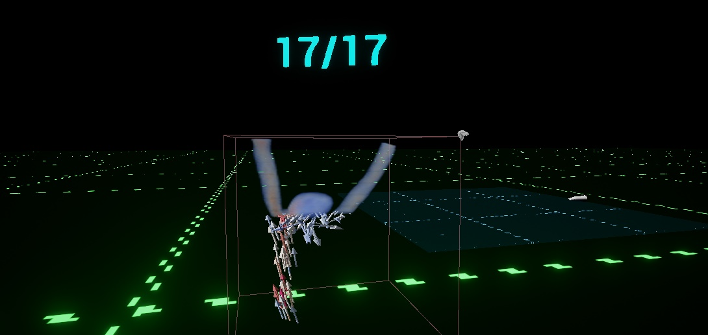

# VRVizualizer
A virtual reality visualization system for scientific data. 

To use the project you need a VR ready PC and a VR headset with room scale support. The HTC Vive is recommended, but the OCULUS Rift should work.

In order to build this project yourself you need to do 5 things.

1. You need UE4.19 which you can download from their launcher: https://launcher-public-service-prod06.ol.epicgames.com/launcher/api/installer/download/EpicGamesLauncherInstaller.msi

2. You need Visual Studio community 2015: https://go.microsoft.com/fwlink/?LinkId=691978&clcid=0x409 Remember to install the C++ module.

3. This git repo: git clone --recurse https://github.com/NoobsDeSroobs/VRVizualizer <Folder name>

4. Right click on the .uproject file and click on "Generate Visual Studio project files".

5. Build the VS project and then launch the game using the .uproject file.

6. In the folder "Additional files" there is a zip file called "Chromo.zip". Add the extracted asset to Content/Chromosome/Wired/

If there is a desire for it I can add the binaries for the C++ code that is included and avoid step 2, 4 and 5.

Demos contained within the project:
 - Rat Brain - A model of some of the major parts of a rat brain. You can pick up and interact with the model. You can customize the model through a menu in the scene. Based on the Waxholm space rat atlas v2.0 by Papp, E. A., Leergaard, T. B., Calabrese, E., Johnson, G. A., & Bjaalie, J. G. (2014). Waxholm Space atlas of the Sprague Dawley rat brain. NeuroImage, 97, 374-386.
 

 - Genome - The genome demo has two models. One has colour coded chromosomes where each domain is represented as a sphere. The other model is colour coded as well, but it shows you the backbone of the chromosomes.
 You can change interact with both models, but only the domain model allows you to change visibility and outline settings.
    

 - Artery with aneurysm - This is the only volumetric model and it is the only model with a time dimension.
 You can interact with the model by picking them up and scaling them as usual, and you can swap between geometric and volumetric representation. 
 The menu allows you to change variables that affect the volumetric render to fit your needs.
 

What functionality this visualizer has:
Most models support being picked up, rotated, translated, scaled and cut. Geometric components can be highlighted. Distances can be measured. Geometric component names can be extracted. 

You move by walking around or by teleporting. The right controller allows you to grab and scale as well as teleport and spawn the cutting plane. The left controller allows you to grab and scale the model as well as measure distance inside the genome demo and extract intersecting component names. Most interactions are model specific and are accessible through a 3D menu in the scene. 

The plugin is not made by me and is only used for testing and showcasing the viability of certain technologies for scientific visualizations. Original source from: https://github.com/sp0lsh/UEShaderBits-GDC-Pack

For any inquiries or questions or feedback, please send an email to magnus_elden (at) hotmail.com with the title containing [VR Visualiser].

Hope you enjoy it.
